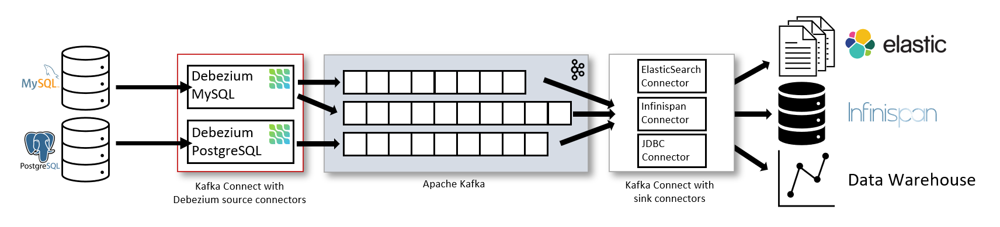

<h1 align="center">
    Debezium
</h1>

<br />

Publish database events on kafka cluster using debezium. But what is debezium?
How can we use it? Why do we even need it? In this project we are going to
work with debezium and give answers to asked questions.

<br />

## Debezium


Debezium is a distributed platform that converts information 
from your existing databases into event streams, enabling applications 
to detect, and immediately respond to row-level changes in the databases. 
Debezium is built on top of Apache Kafka and provides a set of 
Kafka Connect compatible connectors.

<br />

<div align="center">
    
</div>

<br />

### Why do we need this?

The primary use of Debezium is to enable applications to respond almost 
immediately whenever data in databases change.Applications can do 
anything with the insert, update, and delete events. 
They might use the events to know when to remove entries from a cache. 
They might update search indexes with the data.

<br />

## How can we use debezium?

To use debezium you need four main things. First you need a database (mysql, mongodb, ...),
then you need a kafka cluster with a kafka connector (you can use zookeeper), and 
last but not least you need a debezium cluster.

- [Debezium Cluster](https://debezium.io/)
- [Kafka Cluster](https://kafka.apache.org/)
- [Zookeeper](https://zookeeper.apache.org/)

When you are done setting these items, you have to make a connection between them
so debezium can get events from database and push them over kafka with a specific topic.

You need to create a ```.json``` file and send it to debezium cluster. File content is
something like this:

```json
{
  "name": "user-events",
  "config": {
    "tasks.max": "1",
    "connector.class": "io.debezium.connector.postgresql.MySqlConnector",
    "database.server.name": "kafka",
    "database.hostname": "postgresql",
    "database.port": "5432",
    "database.user": "postgres",
    "database.password": "super-secret-password",
    "database.server.id": "5882",
    "schema.history.internal.kafka.bootstrap.servers": "kafka:9092",
    "schema.history.internal.kafka.topic": "_history",
    "database.include.list": "debezium",
    "table.include.list": "debezium.users",
    "include.schema.changes": "true",
    "max.batch.size": "20480",
    "max.queue.size": "81920",
    "poll.interval.ms": "10000",
    "offset.flush.timeout.ms": "60000",
    "offset.flush.interval.ms": "10000",
    "max.request.size": "10485760"
  }
}
```

As you can see we are setting three main configs:

- Database information like host, user, ...
- Kafka bootstrap servers
- Debezium reading configs like batch size, queue size and internal time

Now we need to send this json file to debezium cluster, using
a http request:

```shell
curl -i -X POST -H "Accept:application/json" -H "Content-Type:application/json" localhost:8083/connectors/ -d @config.json
```

Now you can check the connector by the following http request:

```shell
curl -H "Accept:application/json" localhost:8083/connectors/
```

<br />

## Example

Use the command ```docker compose up -d``` to bring up a 
full example of kafka, postgresQL, debezium, kafka consumer, and
http server for making updates on postgresQL.

- ```localhost:7490``` http service
- ```localhost:8083``` debezium cluster
- ```localhost:9092``` kafka cluster

### Requests to http service

#### Get all

```shell
curl -X GET -H "Accept:application/json" localhost:7490/api
```

#### Insert

```shell
curl -X POST -H "Content-Type:application/json" -d '{"name": "amir", "email": "amirhossein.najafizade21@gmail.com"}'
```

You can check the consumer container logs to see if your
kafka cluster is working. (```connector```)

<br />

## Resources

- [https://debezium.io](https://debezium.io/)
- [https://kafka.ap.og](https://kafka.apache.org/)